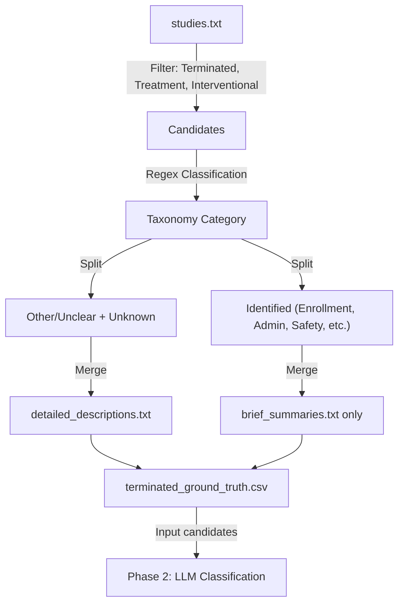

# Codemap: Data Flows (auto-maintained by LLM)
Last updated: 2025-12-06
Responsibility: Major data transformations and pipelines.

## Phase 1: Pilot Extraction

## Key Transformations
-   **Filtering**: `overall_status` = 'TERMINATED', `study_type` = 'INTERVENTIONAL', `primary_purpose` = 'TREATMENT'.
-   **Join** : Left join on `nct_id`.
