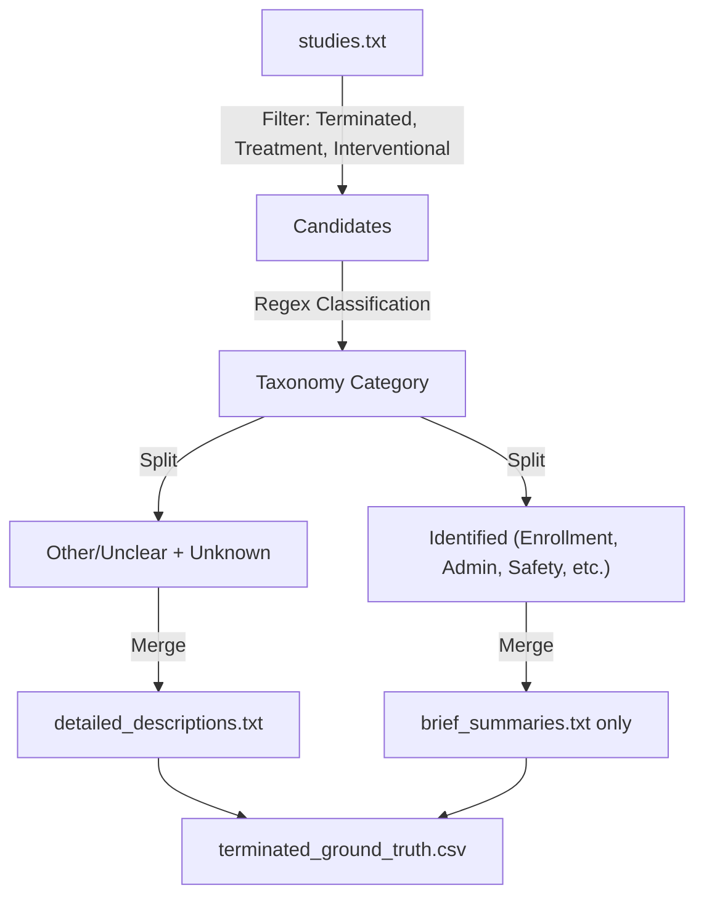
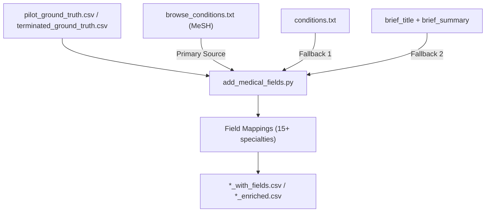

# Codemap: Data Flows (auto-maintained by LLM)
Last updated: 2025-12-06
Responsibility: Major data transformations and pipelines.

## Phase 1a: Ground Truth Extraction

## Phase 1b: Medical Field Enrichment

## Key Transformations
-   **Phase 1a Filtering**: `overall_status` = 'TERMINATED', `study_type` = 'INTERVENTIONAL', `primary_purpose` = 'TREATMENT'.
-   **Phase 1b Classification**: Text matching against medical field taxonomy using MeSH terms → Conditions → Title/Summary hierarchy.
