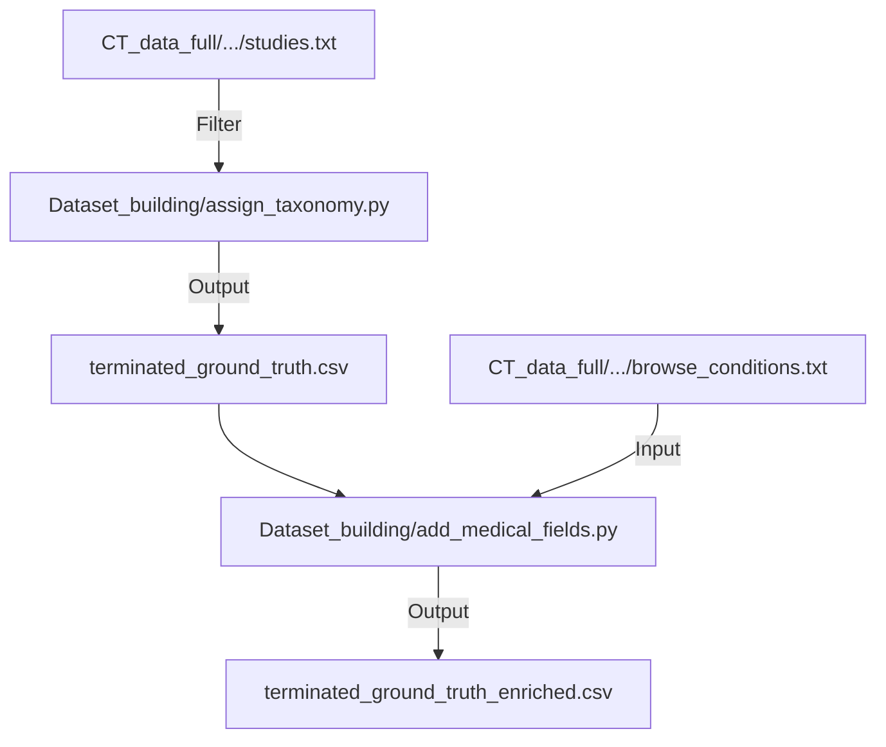

# Codemap: Data Flows (auto-maintained by LLM)
Last updated: 2025-12-11
Responsibility: Major data transformations and pipelines.

## Phase 1a & 1b: Ground Truth Construction


## Phase 1c: Experimental LLM Analysis
```mermaid
graph TD;
    UnclearInput["pilot_unclear_reasons.csv"] --> DeepSeekScript["PhaseI_Endpoint_extraction/analyze_reasons_deepseek.py"];
    DeepSeekScript -->|API Call| DeepSeekAPI[("DeepSeek / OpenAI API")];
    DeepSeekAPI -->|Response| DeepSeekScript;
    DeepSeekScript -->|Append| AnalysisOutput["PhaseI_Endpoint_extraction/output.csv"];

## Phase 2: Prediction Pipeline
```mermaid
graph TD
    pilot_csv[Pilot: pilot_prediction_dataset.csv] --> prepare_script[prepare_llm_input.py]
    prepare_script --> |Generates| json_prompts[JSON: pilot_prompts.json]
    
    system_prompt[Txt: Prediction_prompts_instruct.txt] --> run_script[run_predictions.py]
    json_prompts --> run_script
    
    run_script --> |Request| api[DeepSeek API]
    api --> |Response| run_script
    
    run_script --> |Saves| predictions[JSON: predictions.json]
    
    subgraph Prediction Directory
    prepare_script
    run_script
    json_prompts
    system_prompt
    predictions
    end
```
```

## Key Transformations
-   **Phase 1a Filtering**: `overall_status` = 'TERMINATED', `study_type` = 'INTERVENTIONAL', `primary_purpose` = 'TREATMENT'.
-   **Phase 1b Classification**: MeSH terms -> Conditions -> Title/Summary.
-   **Phase 1c Reasoning**: LLM chain-of-thought extraction for ambiguous termination reasons.
