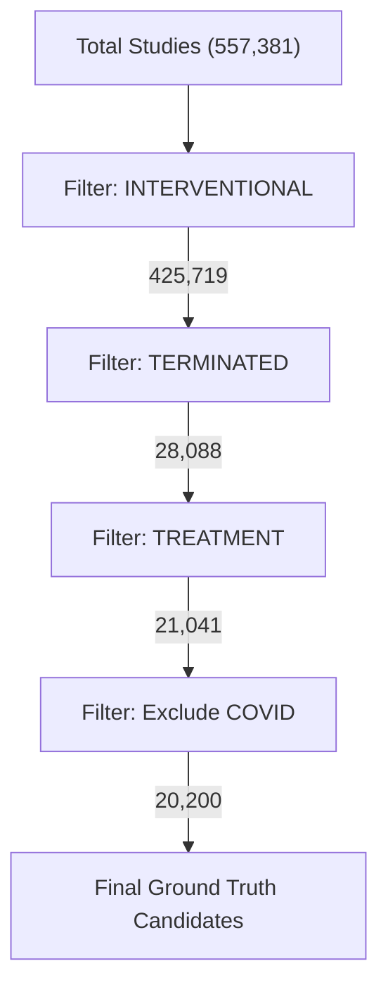

# Data Refinement Pipeline Documentation

## Overview
This document outlines the filtering process to arrive at the "Terminated Ground Truth" dataset.

### Pipeline Flowchart

### Metrics Step-by-Step
1.  **Unique NCT IDs (Start)**: 557,381
2.  **Filter 1: Interventional**: 425,719 (76.4% of total)
3.  **Filter 2: Terminated**: 28,088 (6.6% of Interventional)
4.  **Filter 3: Treatment**: 21,041 (74.9% of Terminated)
5.  **Filter 4: Exclude COVID**: 841 removed (approx).
    *   **Remaining**: 20,200

## Analysis of Termination Reasons
Based on the 20,200 candidates.

### Top Phrases (Exact Match)
1.  **Slow accrual**: ~239
2.  **Sponsor decision**: ~204
3.  **Low accrual**: ~149
4.  **Lack of enrollment**: ~128
5.  **Low enrollment**: ~119
6.  **Lack of funding**: ~117
7.  **Lack of efficacy**: ~75
8.  **Poor accrual**: ~95
9.  **Business decision**: ~90

### Top Keywords (Frequency)
1.  **Enrollment/Accrual/Recruitment**: ~6,000+ mentions combined.
    *   *Interpretation*: The dominant reason for termination.
2.  **Sponsor/Decision/Business**: ~3,500+ mentions.
    *   *Interpretation*: Administrative or strategic stops.
3.  **Safety**: ~1,302 mentions.
4.  **Efficacy**: ~904 mentions.
5.  **Funding**: ~923 mentions.

## Proposed Taxonomy
1.  **Enrollment** (Slow accrual, poor recruitment)
2.  **Administrative** (Sponsor decision, business decision, funding)
3.  **Safety** (Adverse events, safety concerns)
4.  **Efficacy** (Futile, lack of efficacy)
5.  **Other/Unclear** (Logistics, unknown)

## Next Steps
Use this filtered pool of **20,200** studies to build the refined Ground Truth dataset.
